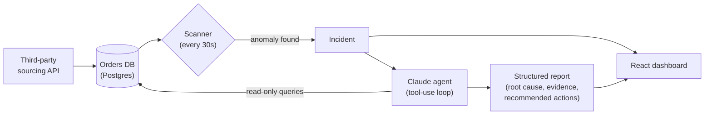

# Tracewell

An AI-powered observability agent for order-sync pipelines. It watches a
database of orders for the kind of failure that's easy to miss by eye —
one stuck record silently blocking every record behind it — and when it
finds one, an LLM agent investigates the root cause the way an on-call
engineer would: by querying the data, forming a hypothesis, and checking it,
then writes up what it found in a structured report a human can act on.

## Why this exists

E-commerce sourcing/sales pipelines that pull orders from a third-party API
often process them in strict sequence, and only advance once each order
reaches a terminal state (e.g. settlement confirmed). If a single order gets
stuck, the whole downstream queue backs up — new orders keep arriving and
getting discovered, they just never make it through. Nothing crashes,
nothing alerts on its own, and by the time someone notices, they're manually
tracing timestamps across days of logs to find the one record that jammed
everything behind it.

Tracewell scans for that class of failure automatically and, instead of
just paging someone with "backlog detected," hands the incident to an agent
that traces it end-to-end and writes up a root-cause report — the way a
human on-call engineer would, minus the multi-day manual timestamp trace.

## What it actually does

1. **Scans continuously** for four classes of anomaly: a single record stuck
   in a non-terminal state, a backlog piling up behind a stuck record, a
   burst of sync failures, and a gap in new records arriving at all.
2. **Investigates autonomously.** When it flags something, a Claude agent
   with a fixed set of read-only database tools digs in on its own —
   pulling the record's history, comparing it against healthy neighbors,
   following whatever the evidence points to — with no human writing the
   query that finds the answer.
3. **Produces a structured report**: root cause, confidence, which records
   are affected, a step-by-step evidence trail, and concrete recommended
   actions. Not a chat transcript — a schema-enforced result you can render,
   store, or pipe into a ticket.
4. **Shows it all on a live dashboard**: pipeline health at a glance,
   the incident list, and each report in full.

## How to use it

Once it's running (see below), open the dashboard at `http://localhost:5173`:

- **Overview** — live stat tiles (backlog size, oldest stuck record, recent
  failure count, last-discovered timestamp) and a 14-day chart of records
  processed per day. A "Scan now" button forces an immediate scan instead
  of waiting for the next interval.
- **Incidents** — every anomaly the scanner has flagged, filterable by
  status. Click one to see the detector's summary, the agent's report (root
  cause, evidence trail, recommended actions), and the specific records
  involved. If a report hasn't been generated yet, an **Investigate** button
  triggers the agent on demand; **Re-investigate** reruns it; **Mark
  resolved** closes it out by hand (it also auto-resolves once the
  underlying condition clears).
- **Orders** — the raw record table, filterable by status, with each row
  expandable to its full event history — the same timeline you'd otherwise
  reconstruct by hand from logs.

Day to day, the only thing you *do* is read incident reports and act on
their recommendations — the scanning and investigating happen on their own.

## Why it's practical

- **It catches the failure class that alerting usually misses.** Uptime and
  error-rate monitors don't see this bug — nothing throws, nothing 5xxs, the
  pipeline just quietly stops making progress on a subset of records. This
  targets that gap specifically.
- **The investigation is the expensive part, and it's automated.** Anyone
  can write a query that says "51 orders aren't synced." Finding *which one*
  is the cause and *why* is the part that used to take days of manual
  timestamp-tracing — that's what the agent does instead.
- **The report is the artifact, not a chat log.** Structured output
  (enforced via a strict tool schema — the API rejects anything not
  conforming) means it's safe to render on a dashboard, store in a
  database, or forward to a ticketing system without parsing prose.
- **It's cheap to run.** The scanner is a plain SQL-querying cron job; the
  (paid, per-call) LLM agent only runs when something's actually flagged,
  not on every scan tick.
- **It's built to extend, not just demo.** Point `DATABASE_URL` at a read
  replica of your real orders table, adjust the Prisma schema and detectors
  to match your actual columns, and the same scanner/agent/dashboard stack
  works on production data. Adding a new failure class is one new file in
  `apps/server/src/scanner/detectors/`; giving the agent more context is one
  new tool in `apps/server/src/agent/tools.ts`.

## Architecture



```
apps/
  server/    Express + TypeScript API: anomaly scanner + Claude tool-use
             investigation agent + REST endpoints
  web/       React + TypeScript dashboard (pipeline health, incidents,
             orders)
packages/
  db/        Prisma schema, migrations, and the seed script that generates
             the mock stuck-order scenario
```

**Scanner** (`apps/server/src/scanner`) runs on an interval and checks for:
stuck orders (`detectStuckOrders`), a backlog piling up behind a stuck order
(`detectBlockedBacklog`), a burst of sync failures (`detectSyncFailureSpike`),
and a gap in new orders arriving at all (`detectDataFlowGaps`). Each finding
becomes an `Incident` row (deduped so it doesn't re-fire every cycle;
auto-resolved once the underlying condition clears).

**Agent** (`apps/server/src/agent`) is a tool-use loop against the Claude
API, not a chat wrapper: it's given a fixed set of read-only database tools
(`get_order`, `get_order_sync_history`, `search_sync_events`, etc., defined
in `agent/tools.ts`) and a system prompt telling it to investigate like an
engineer would. It calls tools iteratively, and finishes by calling a
`submit_incident_report` tool with a **strict** schema — the API guarantees
the result (root cause, confidence, affected orders, evidence trail,
recommended actions) validates exactly, so a malformed model response can
never reach the database.

**Dashboard** (`apps/web`) polls the API for live pipeline stats, lists
incidents with severity/status, and renders each incident's report
including the agent's investigation trail.

## The mock scenario

`packages/db/prisma/seed.ts` generates a deterministic dataset so you can
develop and demo this without production data:

- 300 healthy orders synced over the last ~20 days (with one already-resolved
  transient failure spike mixed in, so the dashboard isn't empty on first load)
- **order #301**: reaches `AWAITING_SETTLEMENT` and never confirms — it's
  the one order in the dataset priced in a different currency (MXN) than
  everything else, which the agent has to notice by comparing it against
  its neighbors, not because it's told
- **orders #302–#351**: a 50-order backlog discovered normally over the
  following 3 days but never synced, because the pipeline won't advance
  its cursor past #301

Nothing pre-labels the currency mismatch as the cause — that's for the
agent to find. In testing, it does: it samples the healthy orders, notices
they're all USD and settle within minutes, notices #301 is the only MXN
order and the only one stuck, and names that as the root cause with high
confidence — then correctly calls the 50-order backlog a *symptom* of the
pipeline's sequential design, not a second, unrelated problem.

## Running locally (without Docker)

Requires Node 20+, npm, and a Postgres instance.

```bash
cp .env.example .env
# edit .env: set DATABASE_URL and ANTHROPIC_API_KEY

npm install
npm run db:migrate
npm run db:seed

npm run dev:server   # http://localhost:4000
npm run dev:web      # http://localhost:5173
```

Without `ANTHROPIC_API_KEY` set, the scanner still detects and lists
incidents — it just skips the automatic investigation step, and any manual
"Investigate" click fails with a clear message instead of crashing.

**If your API key is identity-linked** (spans multiple workspaces), the
first agent call will fail with a 400 asking for a workspace id. Set
`ANTHROPIC_WORKSPACE_ID` in `.env` — find the id at console.anthropic.com
under your workspace settings (it looks like `wrkspc_01...`).

## Running with Docker

```bash
export ANTHROPIC_API_KEY=sk-ant-...
docker compose up --build -d postgres server web
docker compose --profile seed run --rm --build seed
```

Then open http://localhost:5173. The scanner starts polling as soon as
`server` is up (default every 30s — see `SCANNER_INTERVAL_SECONDS`), so the
backlog incident should appear within a minute of seeding, with its
agent-generated report following shortly after.

Postgres is exposed on host port **5433**, not 5432, to avoid colliding with
a locally-installed Postgres — see `.env.example`.

## API reference

| Method | Path | Does |
|---|---|---|
| GET | `/api/pipeline/stats` | Live health snapshot (backlog, cursor, failure count, daily sync counts) |
| POST | `/api/pipeline/scan` | Force an immediate scan cycle |
| GET | `/api/incidents` | List incidents (`?status=OPEN\|INVESTIGATING\|RESOLVED\|IGNORED`) |
| GET | `/api/incidents/:id` | Incident detail, all reports, related orders |
| POST | `/api/incidents/:id/investigate` | Trigger (or rerun) the agent |
| POST | `/api/incidents/:id/resolve` | Mark resolved by hand |
| GET | `/api/orders` | List orders (`?status=...&limit=...`) |
| GET | `/api/orders/:id` | Order detail with full event history |

## Design decisions & what's out of scope

This was built to demonstrate the concept end-to-end — including a live,
unscripted Claude investigation that correctly found a root cause it was
never told — not to run against real production traffic. Deliberately left
out, and what I'd tackle first if that changed:

- **No auth.** The API and dashboard are wide open. Straightforward to add
  (session/JWT middleware on the Express routes) but skipped since this
  never leaves localhost.
- **No automated tests.** Verified manually against live scans and live
  agent runs instead of unit/integration tests. A production version would
  need tests around the detectors' threshold logic (easy — pure functions
  over Prisma queries) and the tool-use loop (harder — needs a fixture
  transcript or a recorded-response mock for the Anthropic client).
- **No CI/CD.** No GitHub Actions workflow gating merges.
- **No cost or rate-limit guardrails** beyond a 12-tool-call cap per
  investigation. Nothing stops repeated manual "Investigate" clicks from
  making repeated paid API calls.
- **No multi-instance coordination.** Two server replicas would each run
  the scanner independently — a real deployment would need a lock (e.g. a
  Postgres advisory lock) around the scan cycle.
- **Polling, not push.** The dashboard polls every few seconds rather than
  using WebSockets/SSE — fine at this scale, not at many concurrent viewers.

## Configuration

See `.env.example` for all variables: connection string, Anthropic model,
API key and optional workspace id, scanner interval, and the thresholds
each detector uses.

## Resetting the demo

```bash
npm run db:reset   # drops and re-migrates, then re-seeds
```

## License

[MIT](LICENSE)
